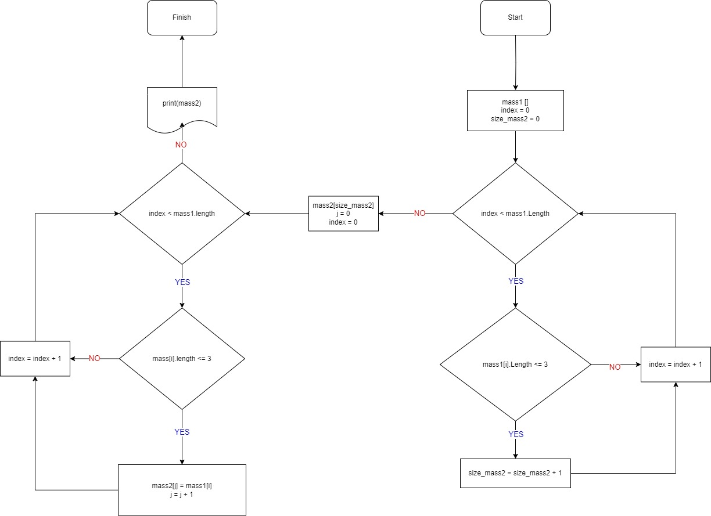

# Control_One
Задача: Написать программу, которая из имеющегося массива строк формирует новый массив из строк, длина которых меньше, либо равна 3 символам. Первоначальный массив можно ввести с клавиатуры, либо задать на старте выполнения алгоритма. При решении не рекомендуется пользоваться коллекциями, лучше обойтись исключительно массивами.  

## Алгоритм решения задачи
1. Задаем исходный массив, счетчик для итерации, а также переменную для размера нового массива.
2. Создаем цикл для проверки всех элементов исходного массива.
3. Каждый элемент проверяется на количество символов:
* если количество символов меньше или равно 3 -> увеличиваем длину нового массива на 1 и переходим к следующему элементу;
* если нет -> переходим к следующему элементу.
4. После того, как прошлись по всем элементам исходного массива, создаем новый массив с длиной, которую получили ранее, создаем счетчик для итерации нового массива, а также обнуляем счетчик исходного массива.
5. Повторяем цикл для проверки всех элементов исходного массива.
6. Каждый элемент проверяется на количество символов:
* если количество символов меньше или равно 3 -> этот элемент записывается в новый массив, увеличиваем счетчик этого массива и переходим к следующему элементу;
* если нет -> переходим к следующему элементу.
7. Когда пролшлись по всем элементам исходно массива, выводим получившийся новый массив.